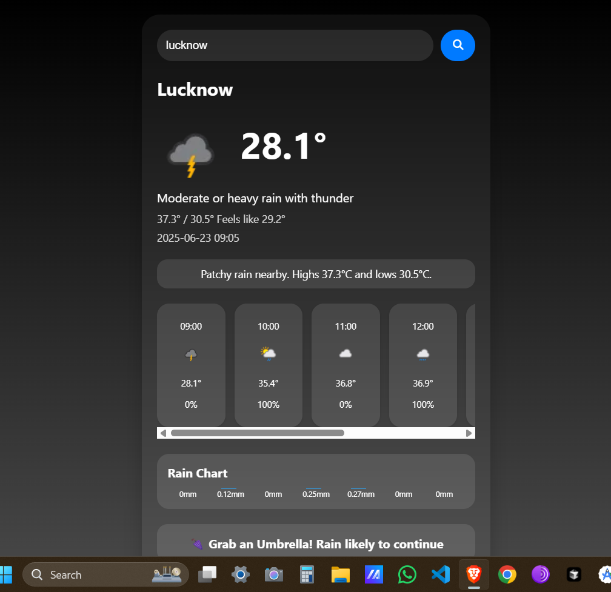

# 🌤️ Weather App

A sleek, responsive weather app built with HTML, CSS, and JavaScript — inspired by the **Samsung Weather** UI.  
It fetches real-time weather data from **WeatherAPI**, including hourly forecasts, rain probability, and condition-based visuals.

---

## 📸 Screenshot



> 🖼️ **To show the screenshot**, upload an image named `screenshot.png` in your GitHub repository's root folder.

---

## 🌐 Live Demo

👉 [Click here to view the app](https://codedBySonu.github.io/weather-app)

---

## ⚙️ Features

- 🌡️ Real-time weather based on city search
- ⛅ Dynamic icon next to temperature
- 📅 Hourly forecast with icons & rain chances
- 🌧️ Rain probability chart
- ☂️ Umbrella tips based on weather
- 💠 Glassmorphic search bar
- 🎨 Background changes with weather condition
- 📱 Fully responsive on all devices

---

## 🛠 Tech Stack

- HTML5
- CSS3 (glassmorphism, gradient backgrounds)
- JavaScript (ES6)
- [WeatherAPI](https://www.weatherapi.com/) for data

---

## 🚀 Getting Started

Clone the repo and open `index.html` in your browser:

```bash
git clone https://github.com/codedBySonu/weather-app.git
cd weather-app

🙌 Credits
Designed & built by Sonu Kumar Singh
Feel free to fork, modify, and share!
Star ⭐ the repo if you liked it 🙂
